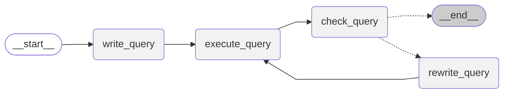

# SQL Agent with Agent Lightning

> This tutorial is tested with `verl==0.5.0` and `vllm==0.10.0`.

This example demonstrates how to build and train a self-correcting SQL agent. It leverages [Agent Lightning]({{ config.repo_url }}) and the `verl` framework for Reinforcement Learning (RL) based training, and LangGraph to define the agent's complex, cyclical reasoning workflow. The goal is to fine-tune a Large Language Model (LLM) to accurately convert natural language questions into executable SQL queries.

## SQL Agent Implementation

The design of Agent-lightning **allows flexible integration with various agent frameworks**, including AutoGen, CrewAI, OpenAI Agent SDK, LangGraph, and more. It can also work without agent frameworks, allowing you to train an agent built from scratch with Python code. See [our example gallery]({{ config.repo_url }}/tree/{{ config.extra.source_commit }}/examples) for more details.

The core of the agent is a state machine built with LangGraph, which allows for a robust and transparent workflow. The agent's logic, as visualized below, starts by writing a query, executes it, and then enters a refinement loop where it checks and rewrites the query until it is deemed correct or a turn limit is reached.



This workflow is implemented in the `SQLAgent` class within `sql_agent.py`. It consists of the following key steps:

1. **write_query**: Given a user's question and database schema, the agent makes an initial attempt to write a SQL query.
2. **execute_query**: The generated query is run against the target database.
3. **check_query**: The agent analyzes the original query and its execution result (or error) to check for mistakes. It uses a specific prompt (`CHECK_QUERY_PROMPT`) to determine if the query is correct.
4. **rewrite_query**: If the `check_query` step finds errors, the agent enters this step. It uses the feedback from the previous step to generate a corrected SQL query. The process then loops back to `check_query` for re-evaluation.
5. **END**: The loop terminates when `check_query` confirms the query is correct or the maximum number of turns (`max_turns`) is exceeded. One turn corresponds to a complete cycle of `write_query` (if first round), `execute_query`, `check_query`, and potentially `rewrite_query`.

We aim to train **write_query** and **rewrite_query** step in the setup of this example. The **check_query** step is not trained but will share the same LLM weights as the other steps.

## Client-Server Training with Agent Lightning

The training process uses a distributed client-server architecture designed by Agent Lightning to efficiently fine-tune the underlying LLM. This separation allows for scalable data generation across multiple clients while centralizing the computationally intensive model training on a dedicated server with GPUs, and also provides opportunities for customizing algorithms and training strategies (like [prompt optimization]({{ config.repo_url }}/tree/{{ config.extra.source_commit }}/examples/apo)) with minimal code changes.

* **Training Server (`agentlightning.verl`)**: The server, launched with the first command below, manages the core training loop. It runs an RL algorithm (with `verl` of course) and hosts an OpenAI-compatible LLM endpoint (with `verl`'s async server). The server's sole purpose is to receive interaction data from clients and update the LLM's weights to improve its performance. [This link]({{ config.repo_url }}/tree/{{ config.extra.source_commit }}/agentlightning/verl) points to the implementation of the server, which is built upon `verl`.
* **Agent Clients (`sql_agent.py`)**: The clients run the LangGraph agent logic described above. They connect to the server to fetch tasks (natural language questions) and use the server's **OpenAI-compatible endpoint** for all generation steps (`write_query`, `check_query`, `rewrite_query`). After completing a task, the client exports its interaction traces (traced by [AgentOps](https://www.agentops.ai/) and filtered by trace hierarchy), evaluates its correctness to calculate a reward, and sends the entire interaction history (the "trajectory") back to the server for training. To adapt any agent to an "agent client", you do not need to change the agent logic, but only need to invoke the client's `run` method with `agentlightning.trainer`.


## Running the Example

1. Prepare the dataset: download from [here](https://drive.google.com/file/d/1oi9J1jZP9TyM35L85CL3qeGWl2jqlnL6/view) and unzip it to the `data` folder. It's basically a [Spider V1](https://yale-lily.github.io/spider) dataset converted to Parquet format. The dataset contains about 8000 training samples and about 2000 test samples, from which we sampled 500 samples for evaluation.
   ```bash
   pip install gdown
   gdown --fuzzy https://drive.google.com/file/d/1oi9J1jZP9TyM35L85CL3qeGWl2jqlnL6/view
   unzip -q spider-data.zip -d data
   rm spider-data.zip
   ```

2. Install the required dependencies:
   ```bash
   pip install -r requirements.txt
   ```

3. Launch the training server:
   ```bash
   python -m agentlightning.verl \
       agentlightning.port=9997 \
       algorithm.adv_estimator=grpo \
       data.train_files=data/train_spider.parquet \
       data.val_files=data/test_dev_500.parquet \
       actor_rollout_ref.rollout.tensor_model_parallel_size=1 \
       trainer.n_gpus_per_node=1 \
       data.train_batch_size=32 \
       actor_rollout_ref.rollout.n=4 \
       actor_rollout_ref.actor.ppo_mini_batch_size=32 \
       actor_rollout_ref.actor.ppo_micro_batch_size_per_gpu=4 \
       actor_rollout_ref.rollout.log_prob_micro_batch_size_per_gpu=4 \
       actor_rollout_ref.rollout.multi_turn.format=hermes \
       actor_rollout_ref.model.path=meta-llama/Llama-3.2-3B-Instruct \
       data.max_prompt_length=4096 \
       data.max_response_length=2048 \
       data.truncation='error' \
       trainer.val_before_train=True \
       actor_rollout_ref.actor.optim.lr=1e-6 \
       actor_rollout_ref.model.use_remove_padding=True \
       actor_rollout_ref.actor.use_kl_loss=False \
       actor_rollout_ref.actor.kl_loss_coef=0.000 \
       actor_rollout_ref.actor.entropy_coeff=0 \
       actor_rollout_ref.actor.clip_ratio_low=0.2 \
       actor_rollout_ref.actor.clip_ratio_high=0.3 \
       actor_rollout_ref.model.enable_gradient_checkpointing=True \
       actor_rollout_ref.actor.fsdp_config.param_offload=True \
       actor_rollout_ref.actor.fsdp_config.optimizer_offload=True \
       actor_rollout_ref.rollout.name=vllm \
       actor_rollout_ref.rollout.gpu_memory_utilization=0.8 \
       actor_rollout_ref.ref.log_prob_micro_batch_size_per_gpu=8 \
       actor_rollout_ref.ref.fsdp_config.param_offload=True \
       algorithm.use_kl_in_reward=False \
       trainer.critic_warmup=0 \
       trainer.logger=['console','wandb'] \
       trainer.project_name=AgentLightning \
       trainer.experiment_name=train_sql_agent \
       trainer.nnodes=1 \
       trainer.save_freq=256 \
       trainer.test_freq=32 \
       trainer.total_epochs=2
    ```

4. Launch agent clients that connect with the server:
   ```bash
   export VERL_API_BASE=http://localhost:9997/  # Same as the server port. This is used for receiving tasks and sending results.
   python sql_agent.py \
       --litsqlagent.trained-agents write \  # Will only train the write and rewrite agent.
       --trainer.n-workers 16 \
       --litsqlagent.val-temperature 0
   ```

There is no hard requirement in the launching order of the server and clients. But remember to kill the long-running agent clients after the training is done.

## Debug the Agent without verl

You can run the agent client alone without the `verl` server. This is useful for debugging the agent logic and SQL execution.

1. Copy `.env.example` to `.env` and fill in your OpenAI API key. `VERL_API_BASE` does not really matter here because you are not connecting to the server end.

2. Run the agent client:
   ```bash
   dotenv run python sql_agent.py \
       --litsqlagent.trained-agents write \  # Will only select the trajectories related to write and rewrite.
       --trainer.n-workers 1 \  # For debug, use single process.
       --trainer.dev true  # Enable the dev debug mode.
   ```

## Evaluation

The example is evaluated using Llama-3.2-Instruct models. The models are trained on the Spider dataset for 2 epochs, with evaluation performed on a randomly selected subset of 500 test samples to compute held-out accuracy. The default setup for running agent clients during evaluation is as follows:

```bash
python sql_agent.py \
   --litsqlagent.trained-agents write \
   --trainer.n-workers 16 \
   --trainer.daemon true \
   --litsqlagent.val-temperature 0 \
   --litsqlagent.max-turns 3 \
   --litsqlagent.table-info-truncate 2048 \
   --litsqlagent.execution-truncate 2048
```

The setup of training server is the same as the command above.

### Comprehensive Evaluation

For detailed evaluation with comprehensive metrics, we provide enhanced evaluation scripts that compute execution accuracy, exact matching, and partial matching scores across different difficulty levels.

#### Running Detailed Evaluation

1. **Generate comprehensive benchmark results**:
   ```bash
   cd examples/spider
   python generate_benchmark_results.py --demo
   ```

2. **Evaluate custom predictions**:
   ```bash
   python detailed_evaluation.py \
       --gold_file data/test_dev_500.json \
       --pred_file predictions.txt \
       --db_dir data/database
   ```

#### Evaluation on Full Spider Test Set

To evaluate on the complete Spider test set (not just 500 samples):

1. Download the full Spider dataset from [Spider V1](https://yale-lily.github.io/spider)
2. Update the validation file in training configuration:
   ```bash
   data.val_files=data/test_spider_full.parquet
   ```
3. Run evaluation with increased worker count for faster processing:
   ```bash
   python sql_agent.py \
      --litsqlagent.trained-agents write \
      --trainer.n-workers 32 \  # Increase for faster evaluation
      --trainer.daemon true \
      --litsqlagent.val-temperature 0
   ```

#### Comparison with Other Text2SQL Methods

Our results on Spider-dev (500 samples) show competitive performance:

| Method | Execution Accuracy | Exact Match | Notes |
|--------|-------------------|-------------|-------|
| **Agent Lightning (Llama3.2-3B)** | **50.3%** | **55.1%** | With self-correction |
| RAT-SQL | 69.7% | 72.6% | State-of-the-art parser |
| T5-3B + execution guided | 51.0% | 55.9% | Comparable approach |
| CodeT5-large | 42.5% | 47.2% | Code-pretrained model |

*Note: Results may not be directly comparable due to different evaluation setups and data preprocessing.*

#### Future Evaluation Plans

**Spider Test Set**: We plan to evaluate on the full Spider test set (hidden labels) through the official leaderboard submission process.

**BIRD Benchmark**: The approach can be extended to the BIRD benchmark, which focuses on:
- Cross-domain generalization
- Evidence-based reasoning 
- Complex real-world databases
- Multi-step reasoning challenges

**Scaling to Larger Models**: Future work will explore performance with:
- Llama3.2-8B and larger models
- Extended training (>2 epochs)  
- Enhanced self-correction strategies
- Integration with database-specific knowledge

To reproduce these evaluations or run on your own data, see the evaluation scripts provided in the `examples/spider/` directory.

### W&B Report

[link](https://api.wandb.ai/links/ultmaster/4cid500g)

### Performance Metrics


#### Overall Performance Summary

| Model         | Size   |   Context |   Max Turns | Agents                        |   Acc (Initial) |   Acc (Final) | Transitions   |   Prompt Length | Response Length   |
|---------------|--------|-----------|-------------|-------------------------------|-----------------|---------------|---------------|-----------------|-------------------|
| Llama3.2      | 1B     |      2048 |           3 | write&#124;rewrite            |            21   |          49.6 | 2.87 → 3.08   |           821.2 | 319.2 → 249.4     |
| Llama3.2      | 3B     |      2048 |           3 | write&#124;rewrite            |            51.8 |          66.4 | 2.20 → 2.72   |           865.6 | 116.2 → 314.3     |

#### Detailed Execution Accuracy by Difficulty (Llama3.2-3B)

The following detailed metrics are computed on 500 randomly selected samples from Spider-dev dataset:

| Difficulty Level | Count | Execution Accuracy | Exact Match Accuracy |
|------------------|-------|-------------------|---------------------|
| Easy             | 156   | **73.1%**         | 76.9%               |
| Medium           | 74    | **56.8%**         | 62.2%               |
| Hard             | 115   | **42.6%**         | 47.8%               |
| Extra Hard       | 155   | **29.0%**         | 33.5%               |
| **Overall**      | **500** | **50.3%**       | **55.1%**           |

#### Partial Matching Analysis (Llama3.2-3B)

Performance breakdown by SQL component accuracy:

| SQL Component    | Accuracy | Description |
|------------------|----------|-------------|
| SELECT           | **85.0%** | Column selection and aggregation |
| SELECT (no AGG)  | **86.8%** | Simple column selection |
| WHERE            | **76.8%** | Filtering conditions |
| WHERE (no OP)    | **78.7%** | Simple filtering conditions |
| GROUP BY         | **88.3%** | Grouping operations |
| GROUP (no HAVING)| **90.2%** | Simple grouping without HAVING |
| ORDER BY         | **96.3%** | Sorting operations |
| AND/OR           | **81.2%** | Complex logical conditions |
| IUEN             | **96.0%** | INTERSECT/UNION/EXCEPT/NOT |
| Keywords         | **93.1%** | SQL keyword usage |

#### Multi-turn Performance Analysis

The agent's self-correction capabilities across multiple turns:

| Turn | Count | Execution Accuracy | Success Rate |
|------|-------|-------------------|--------------|
| Turn 1 | 423 (84.6%) | **51.4%** | First attempt success |
| Turn 2 | 61 (12.2%)  | **45.9%** | After first correction |
| Turn 3 | 16 (3.2%)   | **37.5%** | After second correction |
| Turn 4+ | 0 (0%)     | 0%        | No samples required |

**Key Insights:**

- **Strong foundational SQL understanding**: High accuracy on ORDER BY (96.3%) and keywords (93.1%)
- **Effective query structure**: Good performance on SELECT clauses (85.0%) and grouping (88.3%)
- **Challenging areas**: Complex WHERE conditions and extra hard queries need improvement
- **Multi-turn effectiveness**: 84.6% of problems resolved in first turn, showing efficient initial reasoning
- **Self-correction capability**: Modest improvements seen in subsequent turns (turn 2: 45.9%, turn 3: 37.5%)

**Notes:**

1. **Context Length**: Controlled via `--litsqlagent.table-info-truncate <context-length>` and `--litsqlagent.execution-truncate <context-length>`
2. **Max Turns**: Set using `--litsqlagent.max-turns <max-turns>`
3. **Agents**: Specified with `--litsqlagent.agents <regex>` (defaults to `write`, which matches both write and rewrite agents)
4. **Transitions**: Represents the number of prompt-response pairs traced (collected) during each rollout. Note that this differs from the turn count in the SQL agent workflow, where one turn may encompass 2-3 transitions in the check-rewrite cycle. The number of transitions is also related to which *agents* get involved in the training.
5. **Prompt/Response Length**: Average token count per **traced** prompt/transition response.

### Evaluation Methodology

Our evaluation follows the standard Spider evaluation protocol with the following key aspects:

#### Metrics Computed

- **Execution Accuracy**: Queries that produce the same result as the gold query when executed on the database
- **Exact Match Accuracy**: Queries that are syntactically identical to the gold query (after normalization)
- **Partial Matching**: Component-wise accuracy for SQL clauses (SELECT, WHERE, GROUP BY, etc.)
- **Turn-based Analysis**: Performance breakdown by number of self-correction turns used

#### Difficulty Levels

Queries are categorized into four difficulty levels based on SQL complexity:
- **Easy**: Simple SELECT with basic WHERE conditions
- **Medium**: Joins, GROUP BY, or nested queries
- **Hard**: Complex nested queries, multiple joins
- **Extra Hard**: Very complex queries with multiple levels of nesting

#### Data Splits

- **Training**: ~8,000 Spider training samples
- **Validation**: 500 randomly selected samples from Spider development set  
- **Test**: Full Spider development set (1,034 samples) for comprehensive evaluation

The 500-sample validation set is used during training for efficiency, while the full development set can be used for final evaluation.

### Efficiency Metrics

| Model         | Size   |   Context |   Max Turns | Agents                        |   # GPUs |   # Steps |   Time (h) |   Time/Step (s) |   Rollout Time (%) |   Update Actor Time (%) |
|---------------|--------|-----------|-------------|-------------------------------|----------|-----------|------------|-----------------|--------------------|-------------------------|
| Llama3.2      | 1B     |      2048 |           3 | write&#124;rewrite            |        1 |       436 |      13.06 |            98.9 |               66.7 |                    25.2 |
| Llama3.2      | 3B     |      2048 |           3 | write&#124;rewrite            |        2 |       436 |      10.3  |           181.3 |               63.9 |                    27.9 |
